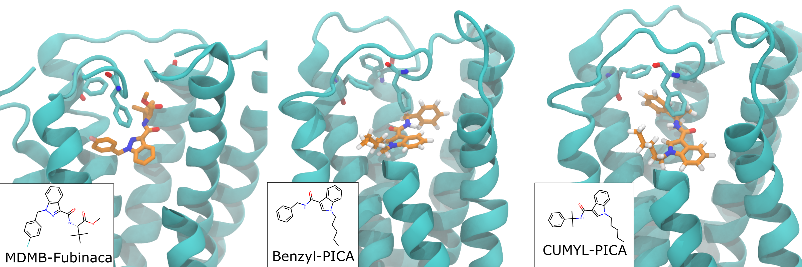
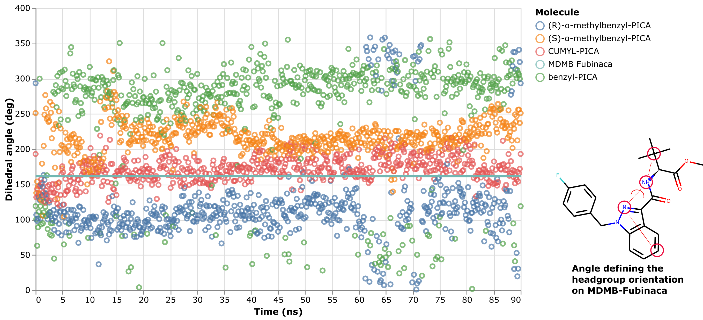

# cannabinoid1_scra

Steps to reproduce:
- Run `align_drugs.py`. This uses rdkit to generate 1000 conformers of each SCRA ligand, then aligns them to MDMB-Fubinaca from the 6N4B crystal structure. That way, the starting coordinates closely match the crystallized ligand.
- Run `parameterize_drugs.py`. This loads the PDB files for each ligand and parameterizes it with OpenForceField.
- Run `make_complexes.sh`. This runs `make_protein_drug_complex.py` which uses parmed to blend the protein+lipid openmm `System` object with the parameterized drug `System` objects. Since MDMB-Fubinaca has already been removed from the protein system, the binding site is empty and can accomodate the ligand atoms without clashes.   
- Run `do_equilibrations.sh`. This runs python script `equilibrate.py` for the ligands of interest. The equilibration consists of applying restraints to the protein coordinates and gradually relaxing. Relaxation of restraints means every 12ps `restraint = 0.9*restraint`
- Run `do_productions.sh`. This runs python script `production.py` which simulates for 90ns using OpenMM.

# Results:
We simulated four ligands with pentyl tails to determine the mechanism of the observed SAR. In short, the crystallized ligand conformation is either maintained or lost depending on the level of steric freedom in the amino group that links the phenyl 'headgroup' and the indole scaffold 'body'. The _in vitro_ data show that the CUMYL linker, i.e. the one with two methyls and therefore the most restricted, has the highest affinity to CB1. Conversely, the benzyl linker, i.e. the one with no methyls and the least restricted, has the lowest affinity. See below for representative snapshots of these two ligands in the CB1 receptor. The CUMYL ligand closely matches the crystallized conformation, while the benzyl ligand has rotated the headgroup around the amino linker to pull the phenyl headgroup onto the opposite side of the binding vestibule.

The two remaining ligands have (R)- or (S) oriented single methyls. The _in vitro_ data shows these have intermediate affinity compared with the CUMYL and benzyl linkers. The simulation data show that the headgroup has intermediate orientations compared to the CUMYL and benzyl ligands, leading to a model where the level of steric freedom in the linker group dictates the position of the headgroup region, with the most restricted ligand perfectly recapitulating the crystal structure conformation and other ligands having close-to or far-away conformations to the same degree as their binding affinity. See below for time traces of the orientation of the headgroup to see this pattern. The orientation is measured by a torsional angle defined across the indole scaffold and headgroup region:

